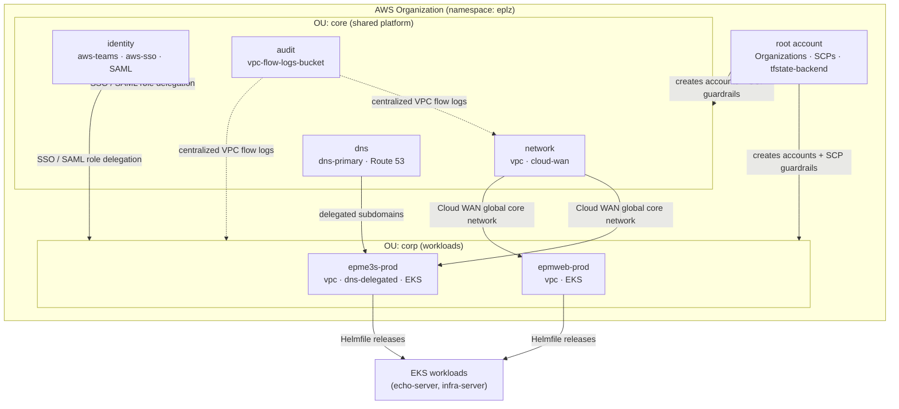

# AWS Landing Zones with Atmos

> Multi-account, multi-region AWS landing zone built as modular Infrastructure-as-Code with Cloud Posse [Atmos](https://github.com/cloudposse/atmos), Terraform, and Helmfile — automated account vending, SSO/SAML role delegation, centralized networking, and security guardrails from a single declarative stack tree.

[](https://github.com/cloudposse/atmos)
[](https://www.terraform.io/)
[](https://github.com/helmfile/helmfile)
[](https://aws.amazon.com/)
[](https://github.com/cloudposse/geodesic)
[](LICENSE)

---

## Overview

Standing up a secure, compliant AWS foundation by hand does not scale: accounts, IAM
delegation, networking, and guardrails drift apart the moment more than one team touches them.
This repository codifies an opinionated **AWS Landing Zone** so that the entire control plane —
the organization, its member accounts, identity, networking, and security baseline — is
provisioned, reviewed, and reproduced as version-controlled configuration.

It uses **Cloud Posse Atmos** to compose Terraform "components" (root modules) against a
hierarchy of YAML **stacks**, one per account/region/stage. Every change flows through a
declarative plan/apply against a known stack, with remote state isolated per account in S3 +
DynamoDB. Operators work from a reproducible **Geodesic** shell, so the toolchain (Terraform,
Atmos, Helmfile, AWS CLI) is identical on every laptop and in CI.

The implementation uses the namespace `eplz` and is organized into two organizational units —
`core` (shared platform accounts) and `corp` (business-unit workload accounts).

**What it provisions**

- **Account vending** — AWS Organizations, OUs, and member accounts from a single `account` component.
- **Identity & access delegation** — centralized `aws-teams` / `aws-team-roles` with SSO permission sets and SAML logins; cross-account `assume-role` chaining.
- **Centralized networking** — per-account VPCs with segmented subnets, VPC Flow Logs, and AWS Cloud WAN tying regions/accounts into a global core network.
- **Security guardrails** — Service Control Policies (SCPs) applied at the org/OU level, encrypted state, and least-privilege IAM.
- **Audit & logging** — dedicated audit account with a centralized, lifecycle-managed VPC Flow Logs bucket.
- **Kubernetes orchestration** — EKS-tagged accounts plus Helmfile releases for in-cluster workloads.

---

## Architecture



Each box is an Atmos **stack** (`{namespace}-{tenant}-{environment}-{stage}`, e.g.
`eplz-core-gbl-network`); each capability is a Terraform **component** applied into that stack.

---

## Tech Stack

| Layer | Technology |
|-------|-----------|
| Orchestration | [Cloud Posse Atmos](https://github.com/cloudposse/atmos) (stacks + components) |
| IaC | [Terraform](https://www.terraform.io/) 1.3.x |
| Kubernetes packaging | [Helmfile](https://github.com/helmfile/helmfile) |
| Cloud | AWS — Organizations, IAM Identity Center (SSO), SAML, VPC, Cloud WAN, Route 53, EKS, S3, DynamoDB |
| Dev environment | [Geodesic](https://github.com/cloudposse/geodesic) shell (Docker) |
| State backend | S3 + DynamoDB (per-account isolation, encrypted, locked) |
| Build / CI | Cloud Posse build-harness + `Makefile` |

---

## Features

- **Automated account creation** — the `account` component drives AWS Organizations, OUs, and
  member-account provisioning declaratively from `stacks/orgs/core/gbl-root.yaml`.
- **IAM role & SSO/SAML delegation** — `aws-teams` defines team roles (admin, devops, viewer) in
  the identity account; `aws-team-roles` projects delegated roles into every other account;
  `aws-sso` wires IAM Identity Center permission sets and per-account assignments; `aws-saml`
  supports SAML-based logins.
- **Centralized networking** — `vpc` builds segmented VPCs (gw / inspection / protected / private
  / data subnet tiers) with optional network firewall; `cloud-wan` builds a global core network
  with per-region edge locations, ASN ranges, and segment/attachment policies tying accounts
  together across `us-east-1` / `us-east-2`.
- **Security guardrails** — Service Control Policies are pulled from Cloud Posse's policy catalog
  (EC2, IAM, KMS, S3, Route 53, CloudWatch Logs, deny-all) and enforced at the OU level;
  `tfstate-backend` enforces encryption and blocks unencrypted uploads.
- **Audit logging** — a dedicated audit account hosts the `vpc-flow-logs-bucket` with S3
  lifecycle transitions (Glacier) and expiry, capturing flow logs centrally.
- **DNS delegation** — `dns-primary` owns the root zone; `dns-delegated` issues per-tenant
  subdomains and ACM certificates into workload accounts.
- **Kubernetes orchestration** — EKS-tagged accounts plus Helmfile releases (`echo-server`,
  `infra-server`) deployed through Atmos with templated ALB ingress, TLS, and cert-manager wiring.
- **Reproducible dev environment** — the `Dockerfile` pins a Geodesic image with exact Terraform
  and Atmos versions, so every operator and CI runner shares one toolchain.

---

## Repository Layout

```text
.
├── atmos.yaml                 # Atmos config: component paths, stack name pattern, backend gen
├── Dockerfile                 # Geodesic shell (pinned Terraform 1.3.5 + Atmos 1.15.0)
├── Makefile                   # build-harness entrypoint (build / install / run)
├── components/
│   ├── terraform/             # Root modules applied by Atmos:
│   │   ├── account            #   AWS Organizations, OUs, member accounts
│   │   ├── account-map        #   account → role-ARN mapping
│   │   ├── tfstate-backend    #   S3 + DynamoDB remote state
│   │   ├── aws-teams          #   team roles (identity account)
│   │   ├── aws-team-roles     #   delegated roles (other accounts)
│   │   ├── aws-sso            #   IAM Identity Center permission sets
│   │   ├── aws-saml           #   SAML identity provider
│   │   ├── dns-primary        #   root Route 53 zone
│   │   ├── dns-delegated      #   per-tenant subdomains + ACM
│   │   ├── vpc                #   segmented VPC + flow logs
│   │   ├── cloud-wan          #   global core network
│   │   └── vpc-flow-logs-bucket
│   └── helmfile/              # Helmfile releases (echo-server, infra-server)
└── stacks/
    └── orgs/
        ├── _defaults.yaml     # namespace, label order, S3 backend
        ├── core/              # gbl-root / identity / dns / network / audit
        └── corp/              # epme3s, epmweb workload accounts
```

> `components/terraform-vendor/` mirrors the upstream Cloud Posse component catalog for reference;
> `stacks-example/` and `stacks-bak/` contain scaffolding and prior iterations and are not part of
> the active `orgs/**` stack tree (`atmos.yaml` only includes `orgs/**/*`).

---

## Getting Started

> Requires Docker and AWS credentials with organization-management access. All Terraform/Atmos/
> Helmfile tooling ships inside the Geodesic container — no local installs needed.

**1. Launch the Geodesic shell**

```sh
make run                 # builds + installs the pinned Geodesic image, then drops you into the shell
atmos version
terraform version
```

**2. Configure AWS credentials** (inside the shell)

```sh
export AWS_PROFILE=org-landing-zones
export AWS_DEFAULT_REGION=us-east-1
aws sts get-caller-identity
```

**3. Bootstrap the core platform**

Apply components in dependency order against their stacks:

```sh
# State backend + organization + account map (root)
atmos terraform apply tfstate-backend -s eplz-core-gbl-root
atmos terraform apply account          -s eplz-core-gbl-root
atmos terraform apply account-map      -s eplz-core-gbl-root

# Identity: team roles + SSO
atmos terraform apply aws-teams        -s eplz-core-gbl-identity
atmos terraform apply aws-sso          -s eplz-core-gbl-identity

# Delegated roles into core accounts
atmos terraform apply aws-team-roles   -s eplz-core-gbl-dns
atmos terraform apply aws-team-roles   -s eplz-core-gbl-audit
atmos terraform apply aws-team-roles   -s eplz-core-gbl-network

# Networking, DNS, audit
atmos terraform apply dns-primary           -s eplz-core-gbl-dns
atmos terraform apply vpc-flow-logs-bucket  -s eplz-core-gbl-audit
atmos terraform apply cloud-wan             -s eplz-core-gbl-network
atmos terraform apply vpc                   -s eplz-core-gbl-network
```

**4. Day-to-day workflow**

```sh
atmos terraform plan  <component> -s <stack>     # preview
atmos terraform apply <component> -s <stack>     # converge
```

Stack names follow `{namespace}-{tenant}-{environment}-{stage}` (e.g. `eplz-epme3s-ue1-prod`).

---

## Notes for Reviewers

This is a portfolio reference implementation, not a deployable configuration. All AWS account IDs
(e.g. `111111111111`), ARNs, email addresses (e.g. `admin@example.com`), and domains
(e.g. `example.com`) in the stack YAML and component files are non-functional placeholders. Before
using any of this as a starting point, replace them with your own account IDs, emails, and domains.
They are not live credentials and contain no secrets, access keys, or state files. (Upstream public
constants from CloudPosse, Datadog, and Spacelift — such as their published AWS account IDs and ECR
registry IDs — are left intact as required by those modules.)

---

## License

[MIT](LICENSE) © Ilia Zlobin

## Author

**Ilia Zlobin** — Principal Software Engineer
Portfolio: [iliazlobin.com/portfolio](https://iliazlobin.com/portfolio)
